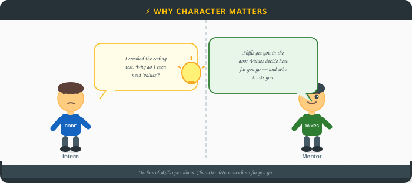
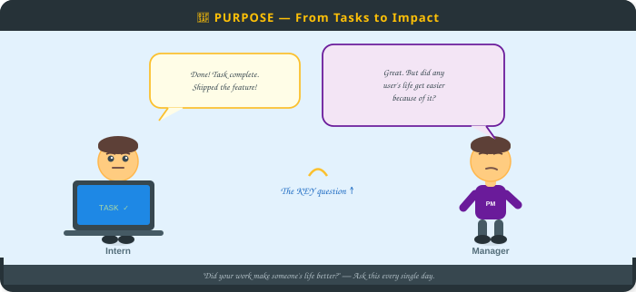
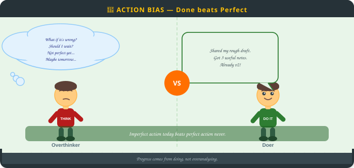
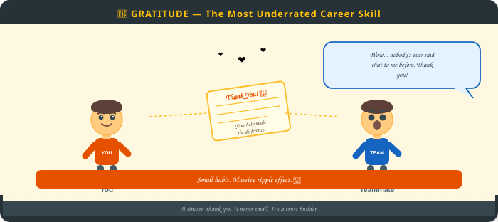
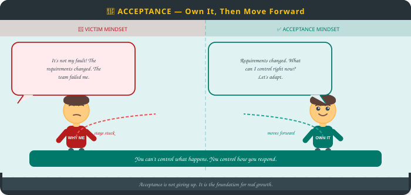
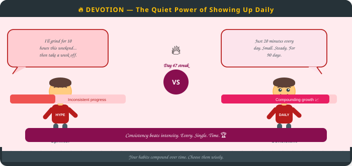

# Character Building for Real-World Impact
### Module 2.1 — Work Values

> **A Practical Guide for Interns, Fresh Graduates & Career Switchers**

*Technical skills open doors. Your mindset, work ethic, and values determine how far you go — and how much others trust and respect you.*




---

## 📋 Table of Contents

| # | Value | One-liner |
|---|-------|-----------|
| 01 | [Purpose](#01-purpose--to-give--enable) | Focus on adding real value and enabling others |
| 02 | [Action Bias & Being Present](#02-action-bias--being-present) | Take thoughtful action and stay engaged in the now |
| 03 | [Kindness & Respect](#03-kindness--respect) | Lead with empathy, listen deeply, treat others well |
| 04 | [Gratitude](#04-gratitude) | Celebrate small wins, appreciate others, recognise progress |
| 05 | [Acceptance](#05-acceptance) | Own your actions, learn from mistakes, focus on what you control |
| 06 | [Devotion — Discipline + Humility](#06-devotion--discipline--humility) | Be consistent, stay open to learning, let your work speak |

> These six values are the foundation for a meaningful, impactful, and sustainable career.

---

## 01 — Purpose: To Give / Enable

### What It Means

Purpose means shifting your question from:

> ❌ *"What task do I need to finish?"*

to:

> ✅ *"How does my work help someone else?"*

It's not just about completing tasks — it's about **creating value** for users, teammates, customers, and society. Let impact guide your work, not just deadlines and deliverables.




### The Three Purpose Questions

Ask yourself these three questions regularly:

| Question | Focus Area |
|----------|------------|
| What value does this add for the user or customer? | External impact |
| What value does this add for my teammates? | Internal impact |
| What value does this add to society? | Broader impact |

### How to Add Real Value

**1. Solve Real Problems**
- Understand pain points deeply
- Build solutions that improve outcomes — not just check boxes

**2. Empower Others**
- Design, write, or build to make others' work easier or better
- Proactively help teammates even when it's not your task

**3. Stay Impact-Driven**
- Let usefulness guide your work, not just deadlines or metrics
- Regularly ask: *"Is this actually helpful to someone?"*

### The Flywheel Effect

```
Create Value → Trust Builds → Impact Compounds → Opportunities Increase → Create More Value
      ↑_____________________________________________________________↑
```

Small purposeful actions lead to big long-term results. This is the flywheel effect.

### 💡 Key Insight

> Purpose is not about passion or motivation — it's about **consistent, intentional focus** on the impact your work creates for others.

### ✅ Real-World Examples

- Build a small script or automation to save your team 30 minutes a week
- Create documentation that helps a new joiner onboard without hand-holding
- Proactively review a teammate's code or design — even when it's not your task
- Simplify a feature so users complete their goal in fewer steps

---

## 02 — Action Bias & Being Present

### What It Means

In fast-paced environments, **overthinking and dwelling on the past** slow you down and drain your energy.

- **Action Bias** = Move forward; don't over-analyse
- **Being Present** = Focus on what you can act on *right now* — not past regrets, not future worries




### Three Core Principles

| Principle | What It Looks Like |
|-----------|-------------------|
| **Act, Don't Overanalyse** | Take small steps; imperfect action beats inaction |
| **Focus on the Now** | Let go of past mistakes; act on what you can influence today |
| **Stay Engaged** | Be fully present in conversations, tasks, and decisions |

### Learn, Then Let Go

Use the past as a **data source** — not a dwelling place:

- ✅ Note what worked (DOs) and what didn't (DON'Ts)
- ✅ Apply the lesson to today's priorities
- ❌ Don't replay mistakes on a loop

### The Avoid vs. Practise Table

| ❌ Avoid | ✅ Practise Instead |
|----------|---------------------|
| Replaying mistakes in your head | Note the lesson, apply it, move on |
| Waiting until your work is 'perfect' | Share early drafts for feedback |
| Multitasking in meetings | Listen actively, write one actionable takeaway |
| Paralysing over multiple options | Pick the best available option and iterate |

### Why Action Helps

- **Reduces Risk:** Small actions reveal problems early — before they become expensive failures
- **Reduces Regret:** Doing something — even imperfectly — leaves you with learning
- **Builds Momentum:** Consistent action creates clarity, confidence, and compounding progress

### 💡 Key Insight

> **Imperfect action beats perfect inaction. Every time.**
> A rough draft shared early gets better faster than a perfect draft that stays in your head.

### ✅ Real-World Examples

- Share a rough draft of your work by end of day — even if incomplete — and ask for input
- In meetings, put your phone away and write down one actionable takeaway
- When you miss a deadline, admit it immediately and propose a clear recovery plan
- When stuck for more than 30 minutes, take one small action or ask one specific question

---

## 03 — Kindness & Respect

### Why It Matters

Your technical output is only as effective as your ability to work with other people. Kindness and respect are **not soft extras** — they are the foundation of:

- 🔒 Trust
- 🛡️ Psychological safety
- 💬 Open communication
- 🤝 Strong collaboration

How you treat others — especially **under pressure** — defines your reputation far more than your code or slides.


### Listening = The Highest Form of Respect

> When you give someone your full, undivided attention, you communicate:
> **"You and your ideas matter to me."**

This single habit builds trust faster than almost anything else you can do at work.

### Three Ways to Practise Daily

**1. Listen Mindfully**
- Give your full attention
- Don't interrupt or multitask while someone is speaking
- Ask follow-up questions to show you're engaged

**2. Communicate with Care**
- Choose your words and tone thoughtfully
- Be honest *and* empathetic — both matter
- Deliver hard messages privately; celebrate publicly

**3. Assume Good Intent**
- Start every interaction with trust
- Avoid jumping to negative assumptions
- When in doubt, ask — don't assume

### 💡 Key Insight

> **Your behaviour in difficult moments — when you're stressed, wrong, or challenged — is what people remember most.** Not how you acted when everything was easy.

### ✅ Real-World Examples

- Stay fully present during conversations — close the laptop, put down the phone
- When someone makes a mistake, address it privately and focus on learning, not blame
- When you disagree: *"I see it differently — can I share my perspective?"* not *"You're wrong."*
- Give a genuine compliment or word of appreciation to a teammate at least once a week

---

## 04 — Gratitude

### What Gratitude Really Is

Gratitude is not a polite formality. It is a **powerful mindset shift** — from focusing on what's missing or broken, to recognising what's working and improving.

In a professional context, gratitude:
- Builds stronger relationships
- Boosts team morale
- Creates a culture where people want to bring their best




### The Ripple Effect

```
You say thank you → Person feels valued → They extend kindness → 
Team culture improves → You notice more progress → Repeat
```

Small habit. Big ripple effect. 🌊

### How to Make It a Habit

| Practice | How |
|----------|-----|
| **Say Thank You** | Often, specifically, sincerely — for efforts, not just results |
| **Celebrate Progress** | Acknowledge milestones, not just final outcomes |
| **Give Public Credit** | Mention teammates' contributions in reviews and standups |
| **Reflect Daily** | One win. One person to appreciate. One thing you learned. |

### Daily Gratitude Reflection (Print & Fill)

| Day | One Win 🏆 | Someone I Appreciated 🙏 | One Learning 📚 |
|-----|-----------|--------------------------|-----------------|
| Mon | | | |
| Tue | | | |
| Wed | | | |
| Thu | | | |
| Fri | | | |

### 💡 Key Insight

> A simple, sincere **"thank you"** — specific and timely — has far more impact than you think. Don't underestimate it.

### ✅ Real-World Examples

- After a project wraps, send a specific thank-you note to each person who helped
- In 1:1s with your manager, mention a colleague who made your week easier
- In team reviews, start by recognising progress made *before* discussing gaps
- Replace *"I did X"* in updates with *"We achieved X — thanks to Y's help on Z"*

---

## 05 — Acceptance

### The Core Idea

Not everything that happens is in your control — and that's okay. When things go wrong, you always have a choice:

| 😤 Victim Mindset | 🌿 Acceptance Mindset |
|------------------|-----------------------|
| Blame external factors | Own your role in the situation |
| Stay stuck in what happened | Focus on what you can control |
| Resist the reality | Respond with intention |
| Ask *"Why me?"* | Ask *"What can I do now?"* |

**Acceptance is not giving up.** It's the foundation for real growth.




### What Acceptance Means — Own Your Reality

- **Strengths** — acknowledge what you're genuinely good at
- **Mistakes** — own them without shame or excuses
- **Current situation** — be honest about where you actually are
- **What you can't control** — let it go; focus your energy on what you *can* influence

### How to Practise Acceptance

**1. Own It**
Take honest responsibility for your wins AND your mistakes. No deflecting, no blame-shifting.

**2. Let Go**
Focus your energy on what you can actually influence — not on what's out of your hands.

**3. Be Honest**
Acknowledge where you truly are today — not where you wish you were.

### Why It Works

Acceptance helps you:
- Think more clearly under pressure
- Make better decisions
- Learn faster from setbacks
- Turn obstacles into lessons instead of excuses

### 💡 Key Insight

> **You can't control what happens to you. You can always control how you respond.** That response is where your power lives.

### ✅ Real-World Examples

- When you miss a deadline: admit it, explain what happened, and present a clear recovery plan
- When project scope changes: adapt quickly instead of resisting the change
- When you receive hard feedback: say *"Thank you — can you tell me more?"* instead of defending
- When a decision goes against your idea: commit fully and execute well, even in disagreement

---

## 06 — Devotion — Discipline + Humility

### What Devotion Means

Devotion is the **quiet power** behind great careers. It's not loud ambition, flashy motivation, or bursts of intensity.

It's the steady, daily commitment to showing up and doing good work — even when no one is watching, even when motivation fades, and even when progress feels slow.

Devotion = **Discipline** (consistency) × **Humility** (openness)




### The Two Pillars

**🏋️ Discipline — Show Up**
- Show up even when motivation fades
- Consistency beats intensity — always
- Your daily habits define your long-term outcomes

**🌱 Humility — Stay Open**
- Stay genuinely open to feedback
- Keep learning — the best professionals are always students
- Leave ego out of your work

### The Power of Habits

```
Good habits → Forward progress → Compounding growth → Who you become
Bad habits  → Stagnation      → Compounding drift  → Who you settle for
```

> **Be intentional about every YES and NO.** Each one shapes who you are becoming.

### Habit Builder — Start Small

> You don't need hours. **15–30 focused minutes daily** on one good habit is enough.

| Habit | Mon | Tue | Wed | Thu | Fri | Sat | Sun |
|-------|-----|-----|-----|-----|-----|-----|-----|
| Skill practice (coding, writing, design) | ○ | ○ | ○ | ○ | ○ | ○ | ○ |
| Review & apply feedback on my work | ○ | ○ | ○ | ○ | ○ | ○ | ○ |
| Deliver reliably — even small things | ○ | ○ | ○ | ○ | ○ | ○ | ○ |
| Learn something new (article, video, book) | ○ | ○ | ○ | ○ | ○ | ○ | ○ |

### 💡 Key Insight

> **Consistency beats intensity. Showing up for 30 minutes every day will always outperform a 10-hour sprint once a month.** Your habits are your character in action.

### ✅ Real-World Examples

- Spend 20 minutes every morning practising a core skill before your workday begins
- After every piece of feedback, write down one action you will take — and do it within 24 hours
- When you say you'll deliver something by a time, deliver it — or communicate proactively
- At the end of each week, ask: *"Was I consistent this week? What one habit can I strengthen?"*

---

## 🏁 Putting It All Together

These six values don't work in isolation — they compound together:

| Value | Core Ask | Daily Action |
|-------|----------|--------------|
| **Purpose** | Does my work help someone? | Ask the 3 impact questions |
| **Action Bias** | Am I moving forward? | Share something — even if rough |
| **Kindness** | Am I treating people well? | Listen fully in one conversation |
| **Gratitude** | Am I noticing what's working? | Thank one person specifically |
| **Acceptance** | Am I owning my reality? | Take responsibility for one thing |
| **Devotion** | Am I showing up consistently? | Do 20 minutes on one core habit |

### Your Next Step

> **Pick ONE value. Choose ONE specific action. Start tomorrow. Tell someone — accountability makes it real. Do it for 21 days.**

---

*Module 2.1 — Character Building | Interns & Career Starters Training Programme*

*[⬅️ Previous: Target Audience] | [⬆️ Table of Contents]*
